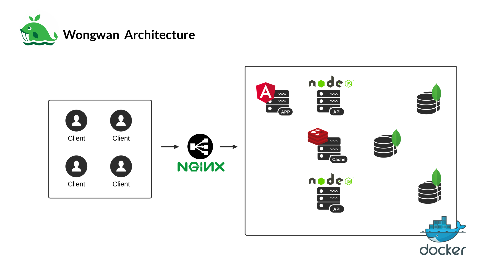

# Introduction
This project is a messenger-like chat application designed for scalability. We use docker to simulate the environment of using multiple node for production deployemnt. 

We use Node.js as a back-end server to provide `api` for the front-end web application. MongoDB cluster is used as the main database and Redis is used as a temporally storage like cache and shared session. The engine for real-time chat is implemented on [Socket.io](https://github.com/socketio/socket.io)
## Prerequisites\
- [Node.js](https://nodejs.org) `7.9.0`

> Note: [nvm](https://github.com/creationix/nvm#installation) is recommended, so you can run `nvm use` to use recommended version of Node.js.

- [Yarn](https://yarnpkg.com/en/docs/install) `0.23.2` or higher
- [Docker Community Edition](https://www.docker.com/community-edition) `17.03.0-ce` or higher
- [Docker Compose](https://docs.docker.com/compose/install) `1.11.1` or higher
- [Angular CLI](https://github.com/angular/angular-cli#installation) `1.0.0` (installed globally)

## Introduction to Yarn

We use `Yarn` package manager instead of `npm` because it is faster and have better reliability on dependencies versioning. Do not forget to use `yarn` instead of `npm`.

Note that, in addition to `package.json` file, we also have `yarn.lock` file, which is generated/edited on running `yarn` command. For any changes to dependencies, do commit changes in `yarn.lock` along with the changes in `package.json` file.

### Useful Commands

Command | Description
--- | ---
`yarn` or `yarn install` | Install all packages listed in `package.json`.
`yarn add express` | Install package `express` and add as `dependencies` to `package.json`. This is equivalent to `npm install --save express`.
`yarn add --dev express` | Install package `express` and add as `devDependencies` to `package.json`. This is equivalent to `npm install --save-dev express`.
`yarn remove express` | Uninstall package `express` and remove from `package.json`. This is equivalent to `npm uninstall --save/--save-dev express`.
`yarn global add @angular/cli` | Install package `@angular/cli` globally on your machine. This is equivalent to `npm install --global @angular/cli`.
`yarn run test:all` or `yarn test:all` | Run script `test:all` as writen in `package.json` file. Note that unlike the `npm` , you can also omit the `run` keyword.
`yarn outdated` | List all the outdated package, i.e. the locally installed package that has a newer version.

You can have a further read on the commands in [Yarn's Docs](https://yarnpkg.com/en/docs/cli/).

## Getting Start
To start front-end development, change directory into web app and then run yarn start
```bash
$ cd webapp   # change directory into webapp
$ yarn start  # run front-end environment with yarn
```
For back-end side, we have to option for you.
The first one is run all necessary container development. To run this, following the instruction below.
```bash
$ cd api   # change directory into webapp
$ docker-compose up --build  # run front-end environment with yarn
```
The other option is running docker as distributed system. There are totally eight nodes of the server. The first one is NGINX which is load balancer of the system. The next one is web application server node which is implemented with Angular2. Besides, there are two api server implemented using Nodejs, api_primary and api_secondary. Also, cache is used in this as a share memory. It is run using Redis. Lastly, a permanent storage, mongodb cluster which contains the cluster of the replica for fault torelant reason.




To run this environment, the commands has to be modified as followings.
```bash
$ cd api   # change directory into webapp
$ docker-compose -f docker-compose.prod.yml up  # run production file
```
